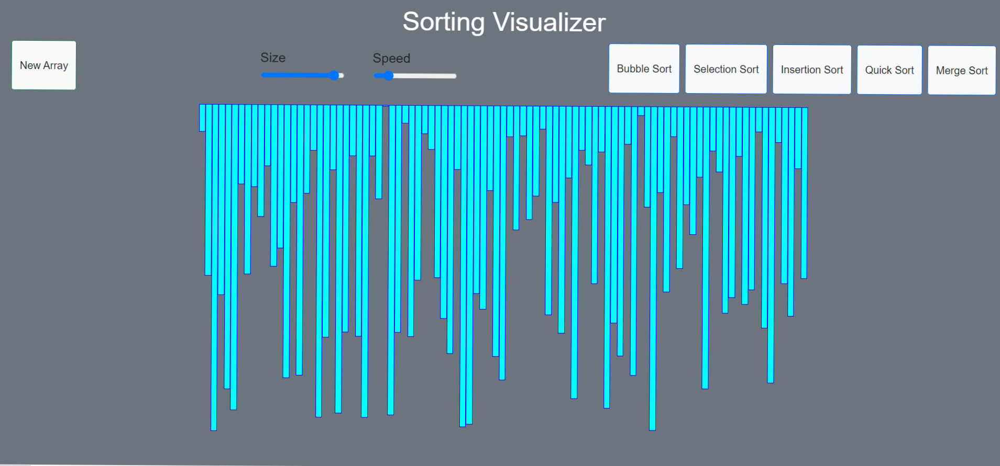

# Sorting Visualization:- 
A sorting visualizer is an interactive tool that graphically demonstrates sorting algorithms, allowing users to observe how elements are rearranged to achieve a desired order. It helps understand algorithm efficiency and performance through visual representation, making it an invaluable resource for learning and analyzing sorting techniques.
### This is a simple visualization project made using javascript 
- Bubble Sort 
- Selection Sort
- Insertion Sort
- Quick Sort
- Merge Sort

### This is built using HTML, CSS, JavaScript  

[Check out the website here](https://paras7403.github.io/Sorting-Visualizer/)

 
